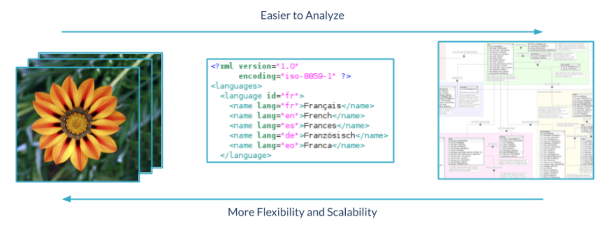
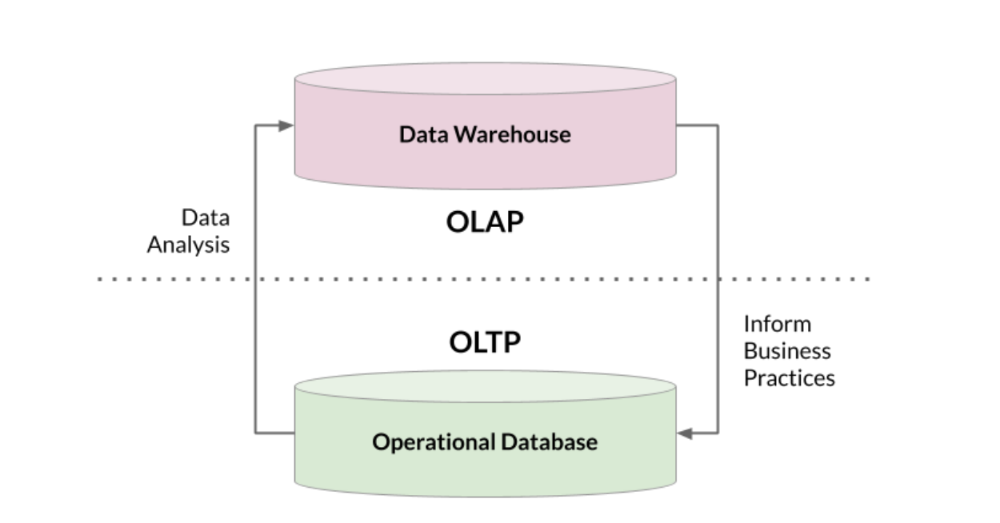
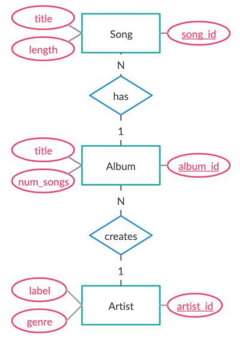
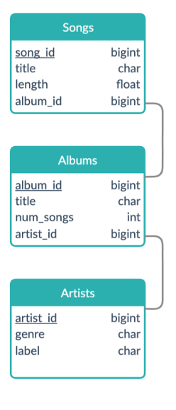
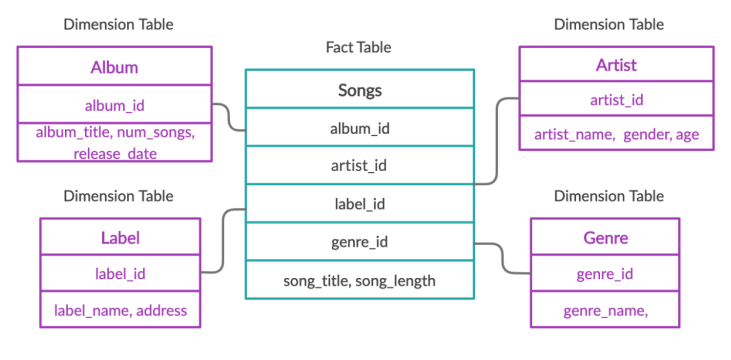

# Data Fundamental
## Tuan Do
---
<!-- _class: lead -->

# Data formats 

---
# Structured data - Dữ liệu có cấu trúc


<div class="grid grid-cols-4 gap-8">
<div class="col-span-2">

* Tuân theo một schema
* **Schemas**: Dữ liệu của tôi nên được tổ chức hợp lý như thế nào?
* Xác định các kiểu dữ liệu và mối quan hệ giữ chúng
* e.g., SQL, các bảng trong cơ sở dữ liệu quan hệ

</div>
<div>


</div>
</div>

---

# Semi-structured data - Dữ liệu bán cấu trúc
<br>
<div class="grid grid-cols-2 gap-8 text-justify">
<div>

* Không theo một schema lớn được định trước
* Cấu trúc được tự mô tả trong chính dữ liệu
* e.g., NoSQL, XML, JSON

</div>
<div>

```json
{
  "firstName": "Joe",
  "lastName": "Jones",
  "address":
  {
    "streetAddress": "1 Main St.",
    "city": "New York",
    "state": "NY",
    "postalCode": "10099"
  },
  "contact":
  [
    {
      "type": "home",
      "number": "555 123-1234"
    },
    {
      "type": "email",
      "address": "joe@litware.com"
    }
  ]
}
```

</div>
</div>

---

# Unstructured data - Dữ liệu phi cấu trúc
<br>
<div class="grid grid-cols-2 gap-8 text-justify">
<div>

* Không có schema
* Chiếm phần lớn dữ liệu trên thế giới
* e.g., photos, chat logs, MP3

</div>
<div>


</div>
</div>


---

# Data Structuring




---
<!-- _class: lead -->

# Hệ thống xử lý dữ liệu

---
# OLTP vs OLAP

<br>
<div class="grid grid-cols-2 gap-8">
<div>

# Hệ thống Xử lý giao dịch trực tuyến (OLTP)

* Online Transaction Processing
* Giao dịch: đơn vị tương tác của một hệ quản lý cơ sở dữ liệu. Giao dịch được xử lý một cách nhất quán và tin cậy mà không phụ thuộc vào các giao dịch khác
* Mục đích của OLTP là xử lý các giao dịch trên cơ sở dữ liệu
* Lưu trữ và cập nhật dữ liệu giao dịch một cách đáng tin cậy và hiệu quả với khối lượng lớn (số lượng giao dịch)
* Quản lý và theo dõi các thông tin kinh doanh dưới dạng giao dịch trong thời gian thực

</div>
<div>

# Hệ thống Xử lý Phân tích Trực tuyến (OLAP)

* Online Analytical Processing
* Mục đích OLAP là phân tích dữ liệu tổng hợp
* Tối ưu hóa cho truy vấn và báo cáo, thay vì xử lý các giao dịch.
* OLAP kết hợp và gộp nhóm dữ liệu để bạn có thể phân tích dữ liệu từ nhiều góc nhìn khác nhau.
* Cơ sở dữ liệu OLTP có thể là một trong số nhiều nguồn dữ liệu cho một hệ thống OLAP.

</div>
</div>

---
# OLTP vs OLAP

<br>
<div class="grid grid-cols-2 gap-8">
<div>

# OLTP tasks

* Tìm giá của một quyển sách
* Cập nhật giao dịch khách hàng mới nhất
* Theo dõi số giờ làm việc của nhân viên

</div>
<div>

# OLAP tasks

* Tính toán đầu sách có tỉ suất lợi nhuận tốt nhất
* Tìm khách hàng trung thành nhất
* Quyết định nhân viên xuất sắc của tháng

</div>
</div>


---
# OLTP vs OLAP

|   |OLTP | OLAP | 
|---|---|---|
| *Mục đích* | Hỗ trợ giao dịch hàng ngày | Báo cáo và phân tích dữ liệu |
| *Thiết kế* | Định hướng ứng dụng | Định hướng chủ đề |
| *Dữ liệu* | up to date, real time | Hợp nhất, lịch sử |
| *Kích thước* | snapshot, gigabyte | archive, terabyte |
| *Truy vấn* | Giao dịch đơn giản và cập nhật thường xuyên | Truy vấn phức tạp, tổng hợp và cập nhật hạn chế |
| *Người dùng* | hàng ngàn | Hàng trăm |


---
# OLTP, OLAP Together



---
<!-- _class: lead -->

# Lưu trữ dữ liệu

---
# Lưu trữ dữ liệu

* **Cơ sở dữ liệu truyền thống**
  - Để lưu trữ dữ liệu có cấu trúc quan hệ thời gian thực => **OLTP**
* **Data warehouse**
  - Để phân tích dữ liệu có cấu trúc => **OLAP**
* **Data Lake**
  - Để lưu trữ tất cả các loại dữ liệu => tăng tính linh hoạt và khả năng mở rộng
  - Để phân tích **dữ liệu lớn**
---
# Cơ sở dữ liệu


<div class="grid grid-cols-4 gap-8">
<div class="col-span-3">

* **Cơ sở dữ liệu (Database)**  là tập hợp dữ liệu có cấu trúc được lưu trữ và truy cập từ hệ thống máy tính.
* **Hệ thống cơ sở dữ liệu quan hệ (RDBMS):** Là một hệ thống phần mềm cho phép tạo lập cơ sở dữ liệu quan hệ và cung cấp cơ chế lưu trữ, truy cập dựa trên các mô hình CSDL quan hệ
* **Thay thế spreadsheet:**
  - Giúp dữ liệu được lưu trữ một cách hiệu quả và có tổ chức
  - Tránh dư thừa, trùng lặp dữ liệu
  - Đảm bảo sự nhất quán trong CSDL
  - Các dữ liệu được lưu trữ có thể được chia sẻ
  - Duy trì tính toàn vẹn dữ liệu
  - Đảm bảo dữ liệu được bảo mật

* Một số RDBMS: **MS SQL Server, MySQL, PostgreSQL, Oracle**
</div>
<div>


</div>
</div>

---
# Data warehouses
<br>
<div class="grid grid-cols-2 gap-8">
<div>

* Tối ưu hóa cho phân tích - OLAP
    - Được tổ chức để đọc / tổng hợp dữ liệu
    - Thường chỉ đọc
* Chứa dữ liệu từ nhiều nguồn
* Massively Parallel Processing (MPP)
* Thường sử dụng dimensional modeling

### Data marts
* Tập con của data warehouses
* Cụ thể hóa cho một topic phân tích (HR, Sales, Marketing, ...)

</div>
<div>


</div>
</div>


---
# Data lakes

* Lưu trữ tất cả các loại dữ liệu với chi phí thấp hơn:
    - ví dụ: thô, cơ sở dữ liệu hoạt động, nhật ký thiết bị IoT, thời gian thực, real-time, relational and non-relational
* Lưu trữ tất cả loại dữ liệu và có thể đến hàng petabyte
* Cần lập danh mục dữ liệu (siêu dữ liệu - mata) nếu không sẽ trở thành **data swamp**
* Phân tích Big Data bằng các dịch vụ như **Apache Spark** và **Hadoop**
    - Hữu ích cho việc học sâu và khám phá dữ liệu vì các hoạt động đòi hỏi rất nhiều dữ liệu

---
<!-- _class: lead -->
# Mô hình dữ liệu quan hệ

---
# Mô hình dữ liệu quan hệ là gì?

* Mô hình những tập hợp các entities từ thực tế dưới dạng các *tables*
* Một entity có thể là bất cứ điều gì ghi lại thông tin; thường là các đối tượng và sự kiện quan trọng.
* Một bảng chứa các hàng và mỗi hàng đại diện cho một reprents duy nhất của một entity.
* Tập hợp các metadata mô tả mối quan hệ giữa các đối tượng và thông tin trong cơ sở dữ liệu. (**Schema**)


---

# Mô hình hóa dữ liệu (Data modelling)

### Quá trình tạo *mô hình dữ liệu* để lưu trữ dữ liệu

1. **Mô hình dữ liệu khái niệm**: mô tả các thực thể, mối quan hệ và thuộc tính
    - Công cụ: sơ đồ cấu trúc dữ liệu, ví dụ: sơ đồ quan hệ thực thể và sơ đồ UML
2. **Mô hình dữ liệu logic**: xác định bảng, cột, mối quan hệ
    - Công cụ: các loại mô hình cơ sở dữ liệu và schema, ví dụ: mô hình quan hệ và star schema
3. **Mô hình dữ liệu vật lý**: chỉ định cách mô hình dữ liệu sẽ được xây dựng trong cơ sở dữ liệu. Phác thảo tất cả các cấu trúc bảng, bao gồm tên cột, kiểu dữ liệu, ràng buộc cột, khóa chính và khóa ngoại với các chỉ mục cho cột bảng có liên quan, mối quan hệ giữa các bảng, thủ tục được lưu trữ và chế độ xem.
    - Công cụ: các loại database, SQL

---
# Example - Relational model

<br>
<div class="grid grid-cols-2 gap-8">
<div>

### Conceptual - ER diagram



Entities, mối quan hệ, các thành phần

</div>
<div>

### Logical - schema



**Fastest conversion: entities become the tables**

</div>
</div>

---
# Beyond the relational model - Dimensional modeling

### Điều chỉnh mô hình quan hệ cho thiết kế Data Warehouse

* Tối ưu hóa cho các truy vấn OLAP: tổng hợp dữ liệu, không cập nhật (OLTP)
* Được xây dựng bằng Star Schema hoặc Snowflake Schema
* Tăng khả năng intepret khi phân tích
* Tăng tính mở rộng cho Schema


---
# Các phần tử dimensional modeling

<br>
<div class="grid grid-cols-2 gap-8">
<div>



### Tổ chức theo:

* Những gì đang được phân tích?
* Các entities thay đổi bao lâu một lần?

</div>
<div>

### Fact tables

* Được quyết định bởi các business usecase
* Những records của một metrics trong biz usecase
* Thay đổi thường xuyên
* Kết nối với Dim tables thông qua các phím ngoại

<br>
<br>

### Dimension tables
* Mô tả các thuộc tính
* Không thay đổi thường xuyên

</div>
</div>

---
<!-- _class: lead -->

# Truy vấn dữ liệu quan hệ - SQL

---
# SQL vs SQL Server
<br>
<div class="grid grid-cols-2 gap-8 text-justify">
<div>

## SQL
- Viết tắt của Structured Query Language - ngôn ngữ truy vấn cơ sở dữ liệu
- Ngôn ngữ chung của các RDBMS
- SQL giúp quản lý hiệu quả và truy vấn cơ sở dữ liệu thông tin nhanh hơn, giúp bảo trì thông tin dễ dàng hơn.
</div>
<div>

## SQL Server
- SQL Server hay Microsoft SQL Server là một RDBMS được phát triển bởi M$
- Phiên bản hiện tại là Microsoft SQL Server 2022, đã hỗ trợ các hệ điều hành khác ngoài Windows
- MS SQL hiện đang là RDBMS phổ biến nhất trên hệ điều hành Windows, được sử dụng nhiều trên các ứng dụng Enterprise tại Việt Nam (Ngân hàng, bệnh viên, ...)
- MS SQL hỗ trợ cả OLTP và OLAP
</div>
</div>

---

# Cài đặt SQL Server (Windows)

- Link: https://docs.microsoft.com/en-us/sql/database-engine/install-windows/install-sql-server?view=sql-server-ver15
- Sử dụng phương pháp đăng nhập `sa`
---

# Cài đặt SQL Server (Docker)


- Để tránh phải config nhiều và có thể sử dụng trên nhiều hệ điều hành, chúng ta sử dụng Docker để cài đặt SQL Server
  - Windows: https://docs.docker.com/desktop/windows/install/
  - Linux: https://docs.docker.com/engine/install/ubuntu/
  - macOs: https://docs.docker.com/desktop/mac/install/

Script docker-compose.yml:
Sử dụng: `docker-compose up`
```yaml
version: "3.9"
services:
    mssql:
        image: 'mcr.microsoft.com/mssql/server'
        ports:
            - '1433:1433'
        environment:
            - ACCEPT_EULA=Y
            - SA_PASSWORD=SuperSceretOla245
        volumes:
            - './drive:/var/opt/mssql/data'
```

---

# Cài đặt Azure Data Studio
- Link: https://docs.microsoft.com/en-us/sql/azure-data-studio/download-azure-data-studio?view=sql-server-ver15

<div class="grid grid-cols-2 gap-8 text-justify">
<div>

### Kết nối với SQL Server
- Khởi động **Azure Data Studio**
- Tại trang **Welcome**, chọn **New Connection**
- Tại khung **Connection**, nhập như bên cạnh
  - **Server Name**: localhost.
  - **Authentication Type**: SQL Login
  - **User name**: User name ở bước trước
  - **Password**: Password **the SQL Server**
  - **Database Name**: `<Default>`
  - **Server Group**: `<Default>`
</div>
<div>


</div>
</div>